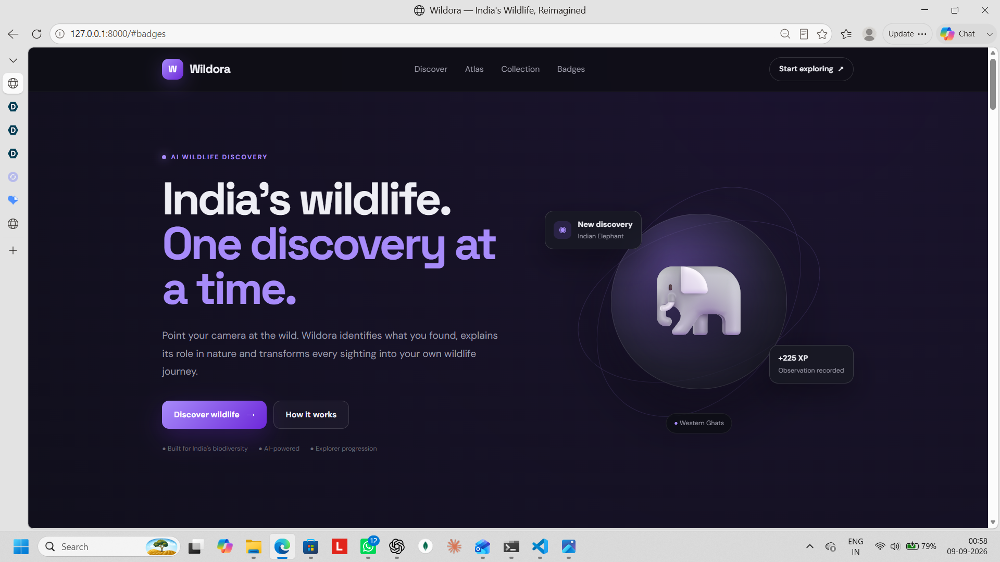
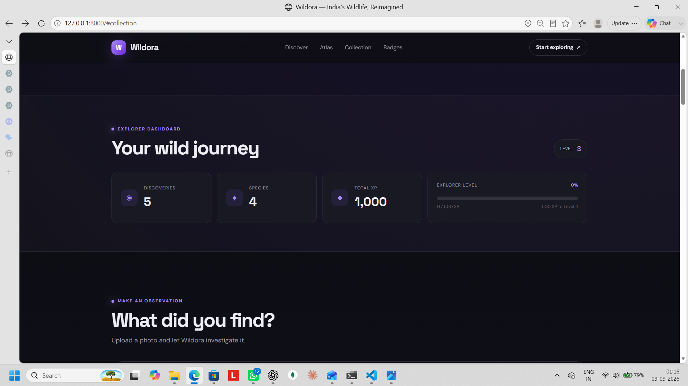
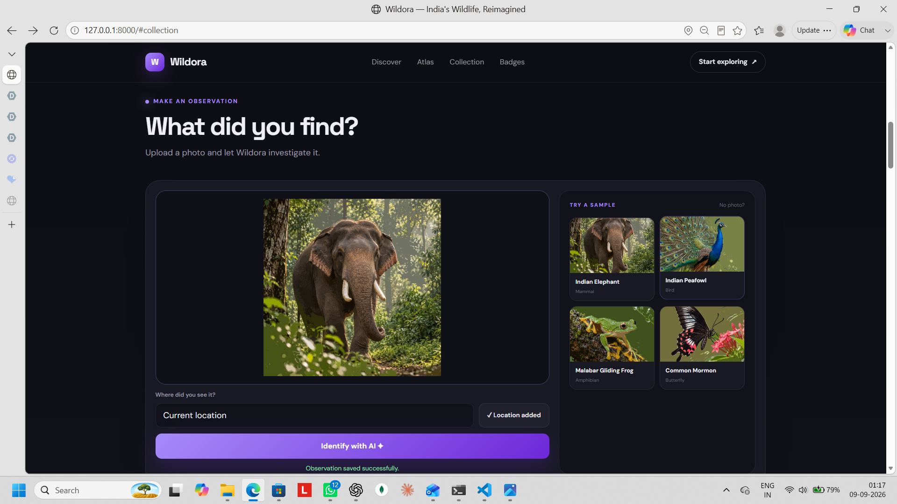
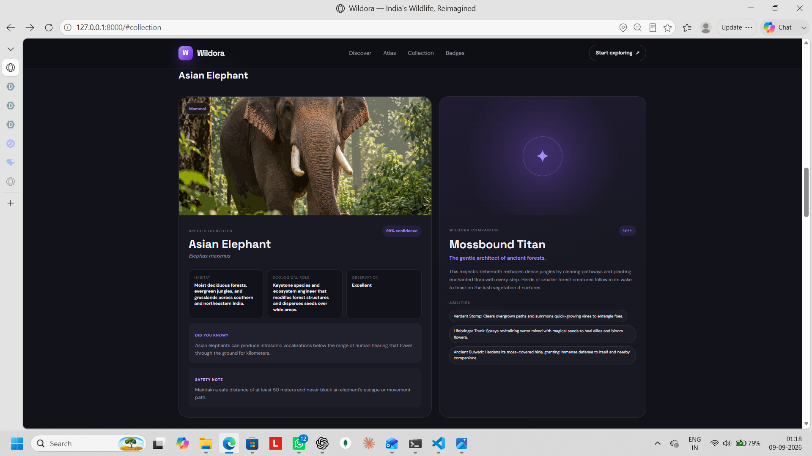
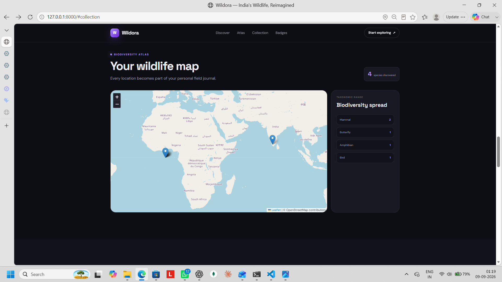
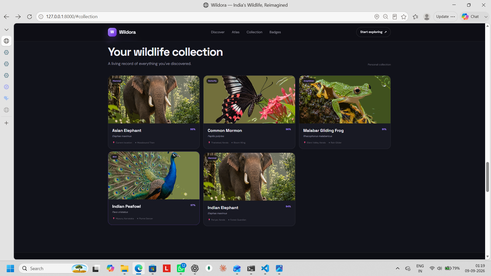
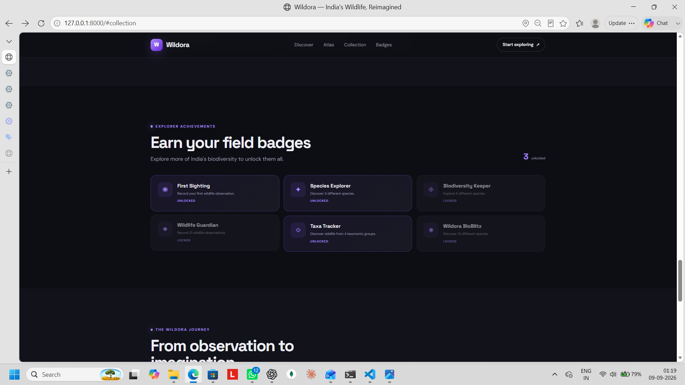
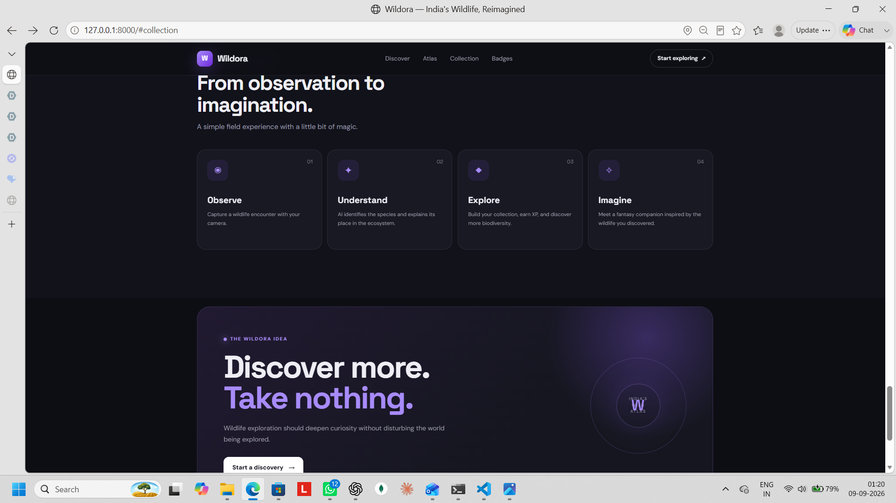

# Wildora 🐘

### Discover wildlife. Earn companions. Protect biodiversity.

Wildora is an AI-powered wildlife discovery platform that turns real wildlife observations into an interactive experience.

Upload a wildlife photo, identify the species with Google Gemini, learn about it, unlock a fantasy companion, earn XP and badges, and explore observations on a biodiversity atlas.

> **The fantasy companion is fictional. The wildlife discovery is real.**

## ✨ Features

- AI wildlife identification
- Species and scientific-name information
- Confidence and observation-quality scores
- Habitat and conservation information
- Responsible wildlife guidance
- Fantasy wildlife companions
- XP, levels and badges
- Personal wildlife collection
- Biodiversity atlas
- Optional observation location
- Demo mode for offline testing

## 🔄 How it works

```text
Upload Photo
     ↓
Gemini Vision
     ↓
Species Identification
     ↓
Wildlife Information
     ↓
Fantasy Companion
     ↓
XP + Badges
     ↓
Collection + Biodiversity Atlas
```

## 🖥️ Screenshots

### Home


### Level & Progress


### Wildlife Upload


### Wildlife Description


### Biodiversity Map


### Collection


### Badges


### Wildlife Information


## 🧠 AI

Wildora uses the **Google Gemini API**.

### Vision model

```text
gemini-3.6-flash
```

Used for wildlife image analysis and species identification.

### Image generation model

```text
gemini-3.1-flash-image
```

Used for fantasy companion artwork when image-generation quota is available.

## 🛠️ Built With

- Python
- FastAPI
- JavaScript
- HTML5
- CSS3
- SQLite
- Google Gemini API
- Leaflet.js
- OpenStreetMap

## 📁 Project Structure

```text
wildora/
├── app/
│   ├── main.py
│   ├── gemini.py
│   ├── db.py
│   └── models.py
│
├── static/
│   ├── index.html
│   ├── app.js
│   ├── style.css
│   ├── demo/
│   └── uploads/
│
├── screenshots/
├── .env.sample
├── .gitignore
├── README.md
└── requirements.txt
```

## 🚀 Run Locally

### 1. Clone

```bash
git clone https://github.com/Aurenox/wildora.git
cd wildora
```

### 2. Create virtual environment

#### Windows

```bash
python -m venv .venv
.venv\Scripts\activate
```

#### macOS / Linux

```bash
python3 -m venv .venv
source .venv/bin/activate
```

### 3. Install requirements

```bash
pip install -r requirements.txt
```

### 4. Configure `.env`

Create a `.env` file in the project root:

```env
GEMINI_API_KEY=YOUR_GEMINI_API_KEY
GEMINI_VISION_MODEL=gemini-3.6-flash
GEMINI_IMAGE_MODEL=gemini-3.1-flash-image
DEMO_MODE=false
```

**Never upload your real `.env` or API key to GitHub.**

## 🎭 Demo Mode

Wildora has two modes.

### Offline / Demo

Set:

```env
DEMO_MODE=true
```

Then run:

```bash
uvicorn app.main:app --reload
```

Open:

```text
http://127.0.0.1:8000
```

Use the built-in demo wildlife samples to test the interface, XP, badges, collection and other local features without live Gemini analysis.

Demo examples include:

- Indian Elephant
- Indian Peafowl
- Malabar Gliding Frog
- Common Mormon

> Real Gemini identification is not available offline.

### Real AI Mode

Set:

```env
DEMO_MODE=false
```

Add a valid Gemini API key:

```env
GEMINI_API_KEY=YOUR_GEMINI_API_KEY
```

Then restart:

```bash
uvicorn app.main:app --reload
```

Upload a real wildlife photograph and Wildora will send it to Gemini for analysis.

Real AI mode requires an internet connection and available API quota.

## ▶️ Start the App

```bash
uvicorn app.main:app --reload
```

Open:

```text
http://127.0.0.1:8000
```

## 🗺️ Biodiversity Atlas

Wildora uses **Leaflet.js** and **OpenStreetMap** to display wildlife observations on a map.

Location is optional.

OpenStreetMap map tiles require an internet connection. The rest of the local demo flow can still be tested offline.

## 🎮 Progression

Users earn XP through wildlife observations and can:

- Increase their Field Level
- Unlock badges
- Discover species
- Build a wildlife collection

## 🛡️ Responsible Wildlife Observation

Wildora encourages users to observe wildlife without disturbing it.

Users are encouraged to:

- Keep a safe distance
- Avoid touching animals
- Avoid feeding wildlife
- Avoid disturbing natural behavior
- Observe responsibly

## 🧩 API

### Health

```text
GET /api/health
```

### Wildlife observation

```text
POST /api/observe
```

### Stored observations

```text
GET /api/observations
```

## ⚠️ AI Limitations

Wildlife identification is probabilistic and can be affected by image quality, lighting, partial views and visually similar species.

Wildora provides confidence information, but AI results should not replace expert wildlife identification.

## 🌱 Future Scope

- Community wildlife observations
- Expert verification
- More Indian species
- Improved species identification
- Geoprivacy for sensitive wildlife locations
- School biodiversity challenges
- Community BioBlitz events
- Offline observation logging
- Mobile application
- Biodiversity analytics
- Conservation-data integration

## 💡 Vision

Wildora aims to make biodiversity discovery engaging, educational and responsible.

```text
See
 ↓
Discover
 ↓
Learn
 ↓
Explore
 ↓
Protect
```

## 🔗 Repository

**GitHub:** https://github.com/Aurenox/wildora

## 👥 Team

Built for hackathon submission.
